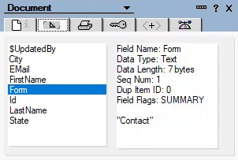
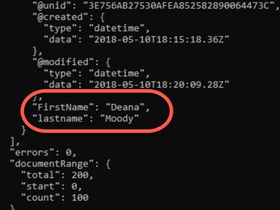

Our application works, but it doesn't return much data we can use. Let's change that.

1. Save the file as `exercise1b.js`.

    This will help in case you need to go back and start over. :-)


1. Add fields you want returned.

    Here is the current call:

    ```JavaScript
    const docs = await db.bulkReadDocuments({
      query: query
    });
    ```

    You can change the call to add fields you want returned. The domino-db API currently has no way to give you a list of what fields are available, so you'll need to use the Notes client to get those. You don't have to open the Notes client for this lab (although you are welcome to do so; the password is `passw0rd`). Here are some of the fields in the document:

    

    The API will return any fields it finds in an array called `itemNames`. Edit the call so it includes the `FirstName` and `LastName` fields, as shown below:

    ```JavaScript
    const docs = await db.bulkReadDocuments({
      query: query,
      itemNames: [
        'FirstName',
        'lastname'
      ]
    });
    ```

1. Save the file and run it from the command line with `node exercise1b.js`.  Your results should look something like this:

    

    Note that data from the `LastName` field is returned, even though we put the name all in lower case. **The API is not case sensitive** when it comes to the names of the fields, so `LastName` and `lastname` will both work, and the JSON which is returned will use the case you specify.
