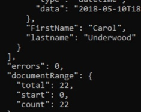
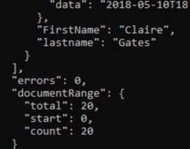

Let's modify the query to reduce the number of records it is returning.

1. Save the file as `exercise1c.js`.

    This will help in case you need to go back and start over. :-)


1. Add fields you want returned.

    Here is the current query:

    ```JavaScript
    const query = " Form = 'Contact' ";
    ```

    (Note: the extra spaces at the beginning and end of the query are not required; they are just to make the query more readable.)

    Let's add to the query so it only returns documents where the state equals "TX" as well.  Modify the query so it looks like this:

    ```JavaScript
    const query = " Form = 'Contact' and state = 'TX' ";
    ```

    In DQL terminology, `Form = 'Contact'` and `state = 'TX'` are both **Terms**. We can combine terms with the **Boolean** `AND`. The Domino engine will return the documents which match both **Terms**.

1. Save the file and run it from the command line with `node exercise1c.js`.  Your results should look something like this:

    

    Now we are only getting 22 documents.  Let's refine the query a little more.

1. Let's modify the query so it does not return any documents where the city equals "Lubbock".  Change the query to look like this:

    ```JavaScript
    const query = " Form = 'Contact' and state = 'TX' and not city = 'Lubbock' ";
    ```

    Note that DQL does not have a "not equal" **Operator**.  Instead, it has an "and not" **Boolean**.  You may think that the query should look like "city != 'Lubbock'" or something like that, but No! use the "and not" syntax.
    
    Save the file and run it; you should see only 20 documents returned:

    


