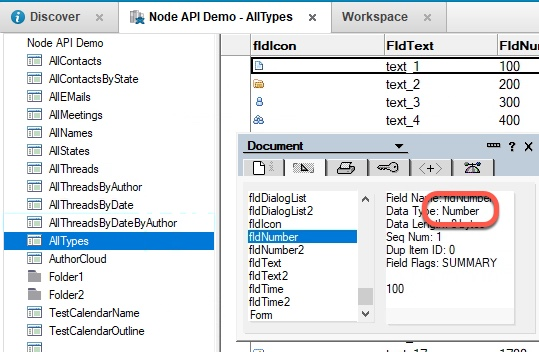
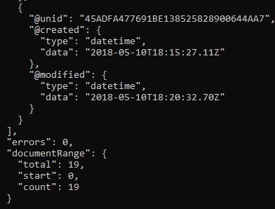
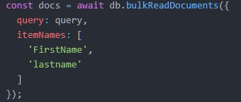

Let's see what else we can do with DQL; specifically, we'll take a look at how to use numbers.

1. Save the file as `exercise1d.js`.

    This will help in case you need to go back and start over. :-)

1. The documents we will use for this query are different than the previous ones.  Here is a screen shot of the `fldNumber` field in one of these new documents; you can see that it is of type "Number".

    

1. Make a brand new query using a number.

    Change the string to match the following:

    ```JavaScript
    const query = " Form = 'AllTypes' and fldnumber > 500 ";
    ```

    This query will look for documents which have the value 'AllTypes' in the Form field, and have a numeric value greater than 500 in the `fldNumber` field.  (As before, the case of the field name is irrelevant, so `fldnumber` works just fine.)

1. Save the file and run it from the command line with `node exercise1d.js`.  Your results should look something like this:

    

    The call is returning 19 documents.  Please note something about the API call and the result set. Your API call should be requesting the `FirstName` and `LastName` fields, like this:

    

    However, those fields don't appear the the JSON returned by the call.  That's right, the API will return the values if they exist in the field...but if they do not exist, you will not get an error; instead, the call will complete but with no fields.

1. Remember, the `fldNumber` field is defined as a number, and the values entered into it are numbers.  Let's see what happens if you treat the field as though it contained strings: change the query to treat the value as a string:

    ```JavaScript
    const query = " Form = 'AllTypes' and fldnumber > '500' ";
    ```

    Run the program again with `node exercise1d.js`. What results did you get? You should have had zero errors, and also zero documents.  The domino-db APIs do not tell you that your field datatype is wrong; they will complete silently and return results which may be confusing at first, until you understand the type of the fields in the Domino database.


