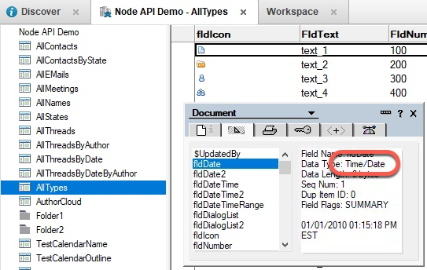

Now we'll see how we can use dates in DQL.

1. Save the file as `exercise1e.js`.

    This will help in case you need to go back and start over. :-)

1. For this query, we'll use the `flddate` field. Take a look at it below; you can see that it is defined as a **Time/Date** field.

    

1. Make a brand new query using a date.

    Change the string to match the following:

    ```JavaScript
    const query = "  Form = 'AllTypes' and fldnumber > 500 and flddate < @dt('2010-01-15') ";
    ```

    This query adds a **Term** which restricts the results to documents which have a `fldDate` less than `2010-01-15`. 

1. Save the file and run it from the command line with `node exercise1e.js`.  Your results should look something like this:

    

    The call is returning 9 documents.  You can experiment with different date values and observe the results. To specify a time, use this format:   
    `@dt('2010-01-15T10:00:00.000')`.


