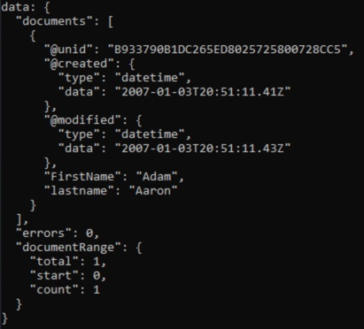

For this exercise, we are using a different database.  You will specify that database, then create the appropriate query.  We are using the **fakenames.nsf**, conveniently provided at <http://www.codestore.net/store.nsf/unid/BLOG-20070104>.

1. Modify the code to point to a different database.

    Lines 9-11 of the file define the `databaseConfig` object. Change it to look like this:

    ```JavaScript
    const databaseConfig = {
      filePath: 'dql/fakenames.nsf'
    };
    ```


1. Change the query to the following:

    ```JavaScript
    const query = " Form = 'Person' and lastname = 'Aaron' and firstname = 'adam' ";
    ```

1. Save the file and run the query by typing the command `node exercise2.js` and hitting Enter.  You should see a result like this:

    

    Note that although the query used the lowercase "adam", the results returned the document with the value "Adam".  Just like DQL is case-insensitive with regard to the field names, it is also case-insensitive with regard to the field values.