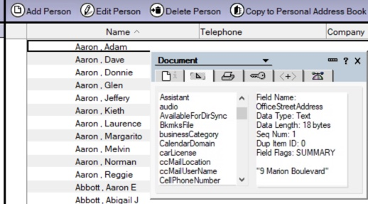
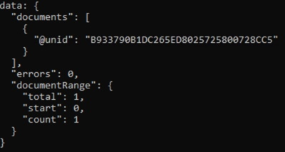
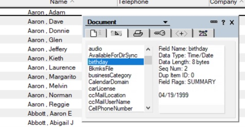

Up to this point we've been using the `bulkReadDocuments` function.  Now we are changing to the `bulkReplaceItems` function.  For every document returned by the query, this function will replace all fields indicated with the hardcoded values provided.

1. Modify the API as follows:

    ```JavaScript
    const docs = await db.bulkReplaceItems({
      query: query,
      replaceItems: {
        birthday: {
          type: 'datetime',
          data: '1999-04-19'
        }
      }
    });
    ```


1. Before you run the query, take a look at the document we are about to change.  Here is a screen shot:


    

    You can see that it does not have a field called "birthday".  The `bulkReplaceItems` function can not only replace existing fields, but if the field doesn't exist it will create it.

1. Save the file and run the query by typing the command `node exercise2.js` and hitting Enter.  You should see a result like this:

    

    The result looks very much like the query result from the previous step, without the `FirstName` or `LastName` fields.  It tells you how many documents were changed (in our case, only one) and how many errors were encountered (zero, I hope!).

1. If you look at the document again using the Notes client, you'll see that the document we changed now has a "birthday" field, containing the value we specified in our call.

    