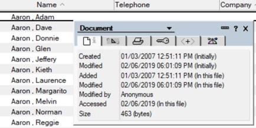
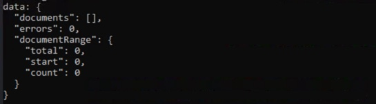

1. Modify the query as follows, adding a term to search on the created field:

    ```JavaScript
    const query = " Form = 'Person' and lastname = 'Aaron' or firstname = 'aaron' and @Created > @dt('2007-01-02')";
    ```

1. Before you run the query, let's take a look at the document using the Notes client.  The first doc in the People view seems to match! It has a first name of "Aaron" and the created date is "01/03/2007".

    

1. Save the file and run it from the command line with `node exercise3.js`. It returns no documents!

    

Let's look closely at the query and figure out why it returned no results.