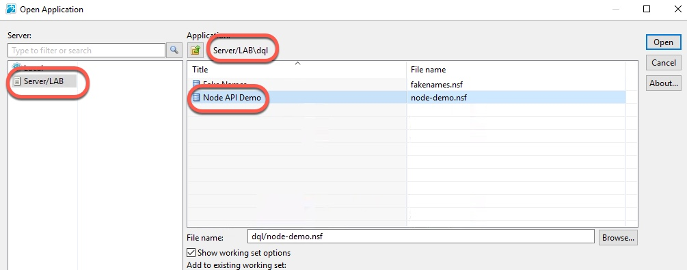
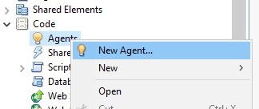
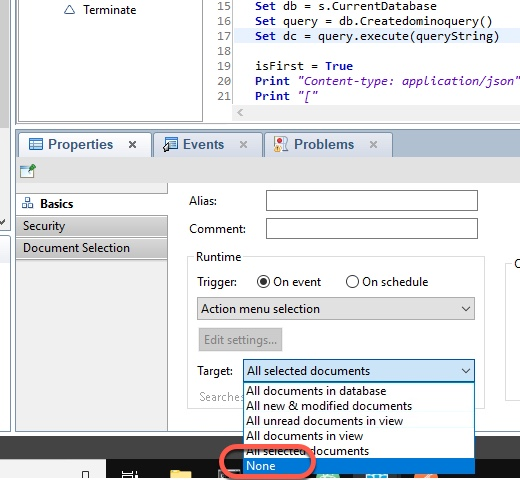
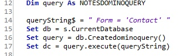

We'll of course use Domino Designer to create our LotusScript application. For this exercise, we'll create an agent which we can invoke via a URL.

1. Open Domino Designer (the icon is on the Desktop) and log in with the password of `passw0rd'.

1. Open the node-demo.nsf database on the server, in the dql directory, as shown in the following screen shot:

    

1. Create a new agent by expanding the **Code** section, right-clicking on **Agents**, and choosing **New Agent..**

    

1. Name the agent `exercise4`, make sure the Type is LotusScript, and click **OK**.

1. Replace the content which is in the agent already with the following code (remember to use the copy/paste technique discussed in the introduction [here]({{ site.baseurl }}/docs/02-using-the-image/)):

    ```
    Option Public
    Option Declare

    Sub Initialize
      
      Dim s As New NotesSession  
      Dim db As NotesDatabase  
      Dim dc As NotesDocumentCollection  
      Dim doc As NotesDocument
      Dim queryString As String
      Dim isFirst As Boolean
      Dim query As NOTESDOMINOQUERY
      
      queryString = " Form = 'Contact' "
      Set db = s.CurrentDatabase
      Set query = db.Createdominoquery()
      Set dc = query.execute(queryString)

      isFirst = True
      Print "Content-type: application/json"
      Print "["
      If dc.Count > 0 Then
        Set doc = dc.GetFirstDocument
        Do While Not doc Is Nothing
          If Not isFirst Then Print ","
          Print |{| _
          & |"firstname":"| & doc.firstname(0) _
          & |","lastname":"| & doc.lastname(0) & |"| _
          & |}| 
          Set doc = dc.GetNextDocument(doc)
          isFirst = False
        Loop
      End If
      Print "]"
      
    End Sub
    ```

1. Change the target for the agent to None by selecting the **Target** dropdown in the Properties section, and changing the value to **None**.

    

1. Make sure there are no errors, then save the agent.

    Before we run the agent, let's take a look at what it is doing. Lines 12-17 are where we will focus:

    

    Line 12 defines an object using the new (in Designer v10.0.1) `NOTESDOMINOQUERY` class.
    
    Line 14 creates the DQL query, which is exactly like the one we used in exercise1.

    Lines 16-17 show how to create and execute a DQL query.

    The rest of the code uses typical LotusScript techniques; one convenience of using DQL in LotusScript is that it returns a familiar `NotesDocumentCollection` object, which makes it easy to integrate DQL into your LotusScript code.
