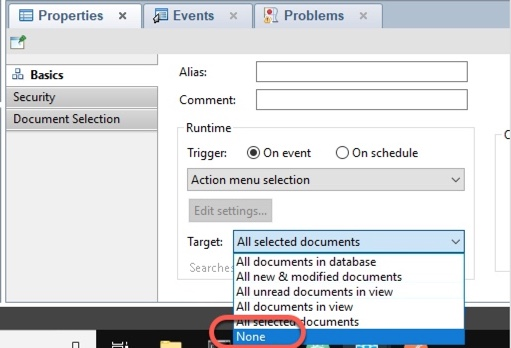
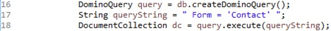

We'll of course use Domino Designer to create our LotusScript application. For this exercise, we'll create an agent which we can invoke via a URL.

1. Open Domino Designer (the icon is on the Desktop) and log in with the password of `passw0rd'.

1. Open the node-demo.nsf database on the server, in the dql directory, as shown in the following screen shot:

    

1. Create a new agent by expanding the **Code** section, right-clicking on **Agents**, and choosing **New Agent..**

    

1. Name the agent `exercise5`, make sure the Type is Java, and click **OK**.

1. Double click on the JavaAgent.java file to open it.

1. Replace the content which is in the agent already with the following code (remember to use the copy/paste technique discussed in the introduction [here]({{ site.baseurl }}/docs/02-using-the-image/)):

      ```
    import java.io.PrintWriter;
    import lotus.domino.AgentBase;
    import lotus.domino.Database;
    import lotus.domino.Document;
    import lotus.domino.DocumentCollection;
    import lotus.domino.DominoQuery;
    import lotus.domino.Session;

    public class JavaAgent extends AgentBase {

      public void NotesMain() {
        PrintWriter pw = this.getAgentOutput();
        try {
          Session session = getSession();
          Database db = session.getCurrentDatabase();
          DominoQuery query = db.createDominoQuery();
          String queryString = " Form = 'Contact' ";
          DocumentCollection dc = query.execute(queryString);
          Document doc = dc.getFirstDocument();
          boolean isFirst = true;
          StringBuffer sb = new StringBuffer();
          sb.append("[");
          while (doc != null && doc.isValid()) {
            String firstName = doc.getItemValueString("FirstName");
            String lastName = doc.getItemValueString("LastName");
            if (!isFirst)
              sb.append(",");
            sb.append("{");
            sb.append("\"firstname\":" + "\"" + firstName + "\",");
            sb.append("\"lastname\":" + "\"" + lastName + "\"");
            sb.append("}");
            isFirst = false;
            doc = dc.getNextDocument();
          }
          sb.append("]");
          pw.println("Content-Type: application/json");
          pw.println(sb.toString());
        } catch (Throwable e) {
          e.printStackTrace(pw);
          pw.println("error occurred");
          pw.println(e.getMessage());
          pw.println(e.getLocalizedMessage());
        }
      }
    }

    ```

1. Make sure there are no errors, then save the file.

1. Switch to the **exercise5 - Agent** tab, and change the target for the agent to None by selecting the **Target** dropdown in the Properties section, and changing the value to **None**.

    

1. Save the agent.

    Before we run the agent, let's take a look at what it is doing. Lines 16-18 are where we will focus:

    

    Line 16 defines an object using the new (in Designer v10.0.1) `DominoQuery` class.
    
    Line 17 creates the DQL query, which is exactly like the one we used in exercise1.

    Line 18 creates and executes the DQL query.

    The rest of the code uses typical Java techniques; one convenience of using DQL in Java is that it returns a familiar `DocumentCollection` object, which makes it easy to integrate DQL into your Java code.
