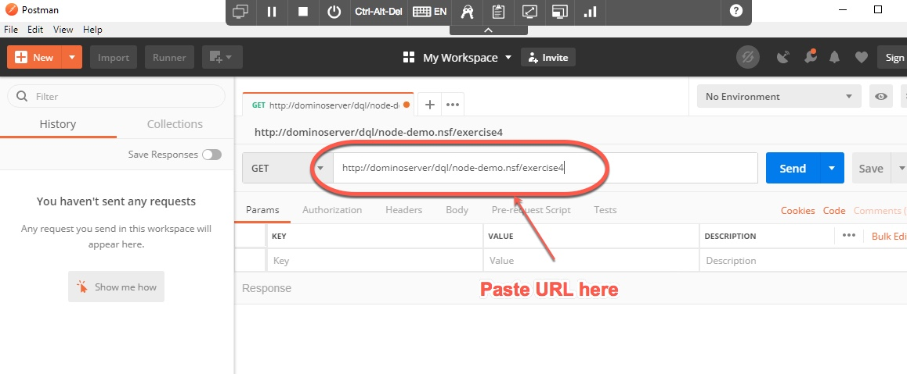
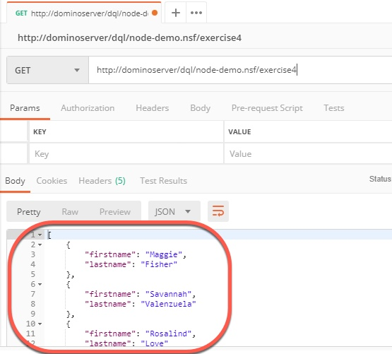

import java.io.IOException;
import java.io.PrintWriter;
import java.io.StringWriter;
import java.text.SimpleDateFormat;
import java.util.Date;
import java.util.Vector;

import com.ibm.json.java.JSONArray;
import com.ibm.json.java.JSONObject;

import lotus.domino.AgentBase;
import lotus.domino.AgentContext;
import lotus.domino.Database; 
import lotus.domino.DateTime;
import lotus.domino.Document;
import lotus.domino.DocumentCollection;
import lotus.domino.Item;
import lotus.domino.Name;
import lotus.domino.NotesException;
import lotus.domino.Session;

public class Service_Discovery extends AgentBase {

	private final String SEARCHTYPE_EQUALS = " = ";
	private final String SEARCHTYPE_CONTAINS = " CONTAINS ";
	private final String SEARCHTYPE_CUSTOM = " CUSTOM ";

	public void NotesMain() {

		Database db = null;
		Document doc = null;
		DocumentCollection dc = null;
		
		JSONObject jsonResponse = new JSONObject();

		try {
			Session session = getSession();
			AgentContext agentContext = session.getAgentContext();
			db = session.getCurrentDatabase();

			Vector vec = agentContext.getDocumentContext().getItemValue("Request_content");
			String body = vec.get(0).toString();
			JSONObject jsonBody = JSONObject.parse(body);
			String ftSearchQuery = buildFTSearch(jsonBody);

			//  System.out.println("FULL QUERY:");
			//  System.out.println(ftSearchQuery);

			PrintWriter pw1 = this.getAgentOutput();
			pw1.println("Content-Type: application/text");
			pw1.println(ftSearchQuery);
			if (true) return;
			
			dc = db.FTSearch(ftSearchQuery, 500);
			doc = dc.getFirstDocument();

			if (doc == null || !doc.isValid()) {
				JSONObject errorPayload = new JSONObject();
				errorPayload.put("count", 0);
				errorPayload.put("data", new JSONArray());
				errorPayload.put("service", "discovery");
				errorPayload.put("message", "No Documents Found");
				jsonResponse.put("api", errorPayload);
			} else {
				Document temp;
				JSONArray data = new JSONArray();
				long count = 0;
				while (doc != null) {
					JSONObject cust = new JSONObject();
					JSONObject detail = new JSONObject();
					JSONArray parts = new JSONArray();

					String companyName = doc.getItemValueString("CompanyName");
					if (companyName != null && companyName.trim().length() > 0) {

						Item item = doc.getFirstItem("EndDate");
						String dateEndDate = "";
						if (item != null) {
							DateTime dt = item.getDateTimeValue();
							if (dt != null) {
								dateEndDate = formatNDT(dt, "yyyy-MM");
								dt.recycle();
							}
						}
						if (item != null)
							try {
								item.recycle();
							} catch (Exception r1) {
							}

						Item item2 = doc.getFirstItem("LastOrderDate");
						String dataLastOrder = "";
						if (item2 != null) {
							DateTime dt = item2.getDateTimeValue();
							if (dt != null) {
								dataLastOrder = formatNDT(dt, "yyyy-MM");
								dt.recycle();
							}
						}
						if (item2 != null)
							try {
								item2.recycle();
							} catch (Exception r1) {
							}

						Name namClaimed = session.createName(doc
								.getItemValueString("IBMClaimedBy"));
						Name namAssigned = session.createName(doc
								.getItemValueString("IBMAssignedTo"));

						detail.put("parts", parts);
						cust.put("detail", detail);

						cust.put("id", doc.getNoteID());
						cust.put("GEO", doc.getItemValueString("Geography"));
						cust.put("CUSTOMER", doc
								.getItemValueString("CompanyName"));
						cust.put("VAD", doc.getItemValueString("VADNAME"));
						cust.put("BP", doc
								.getItemValueString("BusinessPartnerName"));
						cust.put("DATE_ENDDATE", dateEndDate);
						cust.put("DATE_LASTORDER", dataLastOrder);

						cust.put("INT_LASTORDERVAL", doc
								.getItemValueInteger("LastOrderAmount"));
						cust.put("INT_2018Pur", (doc
								.getItemValueInteger("purchase2018Value")));
						cust.put("INT_2017Pur", (doc
								.getItemValueInteger("purchase2017Value")));
						cust.put("INT_2016Pur", (doc
								.getItemValueInteger("purchase2016Value")));
						cust.put("INT_2015Pur", (doc
								.getItemValueInteger("purchase2015Value")));
						cust.put("INT_2014Pur", (doc
								.getItemValueInteger("purchase2014Value")));
						cust.put("INT_2013Pur", (doc
								.getItemValueInteger("purchase2013Value")));
						cust.put("INT_2012Pur", (doc
								.getItemValueInteger("purchase2012Value")));
						cust.put("INT_2011Pur", (doc
								.getItemValueInteger("purchase2011Value")));
						cust.put("INT_2010Pur", (doc
								.getItemValueInteger("purchase2010Value")));
						cust.put("INT_2009Pur", (doc
								.getItemValueInteger("purchase2009Value")));
						cust.put("INT_2008Pur", (doc
								.getItemValueInteger("purchase2008Value")));

						cust.put("CTRYCODE", doc
								.getItemValueString("CNTRY_CODE"));
						cust.put("NUMBER", doc.getItemValueString("CNTRY_CODE")
								+ doc.getItemValueString("IBMCustNo"));
						cust.put("DATE_LASTPMR", doc
								.getItemValueString("lastDTPMR"));
						cust.put("IBMClaimedBy", namClaimed.getAbbreviated());
						cust.put("IBMAssignedTo", namAssigned.getAbbreviated());
						cust.put("Deployment", doc
								.getItemValueString("Deployment"));
						cust.put("Status", doc.getItemValueString("Status"));

						cust.put("detail", detail);
						data.add(cust);
						count = count + 1;
						try { // recover names
							if (namClaimed != null) {
								db.recycle();
							}
							if (namAssigned != null) {
								db.recycle();
							}
						} catch (Exception js1) {
							js1.printStackTrace();
						}

					}
					temp = doc;
					doc = dc.getNextDocument(temp);
					temp.recycle();

				}

				JSONObject responsePayload = new JSONObject();
				responsePayload.put("service", "discovery");
				responsePayload.put("data", data);
				responsePayload.put("count", count);
				responsePayload.put("code", 200);
				jsonResponse.put("api", responsePayload);

			}

			PrintWriter pw = this.getAgentOutput();
			pw.println("Content-Type: application/json");
			pw.println(jsonResponse.serialize(true));

		}  catch (Exception e) {
			e.printStackTrace();
			JSONObject errorPayload = new JSONObject();
			errorPayload.put("service", "discovery");
			errorPayload.put("message", "Unable to retrieve results");
			errorPayload.put("code", 500);
			StringWriter sw = new StringWriter();
			PrintWriter stackPrintWriter = new PrintWriter(sw);
			e.printStackTrace(stackPrintWriter);
			errorPayload.put("stack", sw.toString());
			jsonResponse.put("api", errorPayload);
			PrintWriter pw = this.getAgentOutput();
			pw.println("Content-Type: application/json");
			try {
				pw.println(jsonResponse.serialize(true));
			} catch (IOException e1) {
				e1.printStackTrace();
			}
		} finally {
			try {if (doc != null) { doc.recycle(); }} catch (Exception js1) {}
			try {if (dc != null) {dc.recycle();}} catch (Exception js1) {}
			try {if (db != null) {db.recycle();}} catch (Exception js1) {}
		}
	}

	/**
	 * Converts a Notes Date Time into a String
	 * 
	 * @param dt
	 * @param format
	 * @return
	 */
	private String formatNDT(DateTime dt, String format) {
		String result = "";
		SimpleDateFormat formatter = new SimpleDateFormat(format);
		try {
			result = formatter.format(dt.toJavaDate());
		} catch (NotesException e) {
			e.printStackTrace();
		}

		return result;
	}

	/**
	 * Build a search query
	 * 
	 * @param o
	 *            supplied filters
	 * @return queryString formated for DOMINO
	 */
	private String buildFTSearch(JSONObject o) {

		String query = " ([Form] = \"Organisation\" OR [Form] = \"fmOrganisation\") ";

		if (o.get("searchText") != null && !o.get("searchText").equals("*")) {
			String searchText = o.get("searchText").toString();
			if (searchText.length() > 0)
				query = query + " AND (([CompanyName]  CONTAINS  \""
						+ searchText + "*\") OR ([VADName]  CONTAINS  \""
						+ searchText + "*\") OR ([BusinessPartnerName]  CONTAINS  \""
						+ searchText + "*\"))";
		}

		// Build filter lists :
		query = buildList(query, o, "IOT", "Geography", SEARCHTYPE_EQUALS, "id");
		query = buildList(query, o, "IMT", "CountryCode", SEARCHTYPE_EQUALS,
				"id");
		query = buildList(query, o, "MARKET", "CRM_RGN_DSCR",
				SEARCHTYPE_EQUALS, "label");
		query = buildList(query, o, "PARTNER", "BusinessPartnerName",
				SEARCHTYPE_EQUALS, "name");
		query = buildList(query, o, "INDUSTRY", "INDUSTRY", SEARCHTYPE_EQUALS,
				"text");
		query = buildList(query, o, "CTRYCODE", "CNTRY_CODE",
				SEARCHTYPE_EQUALS, "id");
		query = buildList(query, o, "CVRAGE_BASE_NUM", "CVRAGE_BASE_NUM", SEARCHTYPE_EQUALS, "id");
		query = buildList(query, o, "STATUS", "Status", SEARCHTYPE_EQUALS, "id");
		query = buildList(query, o, "PRODUCT", "WWIDE_PROD_CAT",
				SEARCHTYPE_CONTAINS, "id");
		query = buildListChannel(query, o, "CHANNEL",
				"SAP_DISTRIBTN_CHNL_CODE_IMPORTED", SEARCHTYPE_CUSTOM, "id");
		query = buildListClaimed(query, o, "CLAIMED", "IBMClaimedBy",
				SEARCHTYPE_CUSTOM, "id");
		query = buildListPurchased(query, o, "PURCHASE", "", SEARCHTYPE_CUSTOM,
				"id");
		query = buildListActive(query, o, "ACTIVE", "EndDate",
				SEARCHTYPE_CONTAINS, "id");
		query = filterMyClaims(query, o);
		return query;
	}

	private String filterMyClaims(String query, JSONObject o) {

		if (o == null || o.get("viewAllOrgs") == null) {
			return query;
		}

		boolean allOrgs = (Boolean) o.get("viewAllOrgs");
		if (!allOrgs) {
			try {
				String username = getSession().getEffectiveUserName();
				Name nam = getSession().createName(username);
				query = query + "  AND ([IBMClaimedBy] = \""
						+ nam.getAbbreviated() + "\") ";
				nam.recycle();
			} catch (NotesException e) {
				e.printStackTrace();
			}
		}
		return query;
	}

	/**
	 * 
	 * @param query
	 * @param o
	 * @param filterId
	 * @param notesField
	 * @param searchType
	 * @param key
	 *            : the field name in the supplied json to use as part of
	 *            search. The JSON data provded by the webapp will send :
	 *            {id:"1", label:"sometext"} so if you wanted to use the label
	 *            as the search text set key to "label"
	 * @return
	 */
	private String buildList(String query, JSONObject o, String filterId,
			String notesField, String searchType, String key) {

		Object flt = o.get("filters");

		if (flt == null || flt instanceof JSONArray) {
			return query;
		}

		JSONObject filters = (JSONObject) flt;

		// User didnt select a GEO so add the users readable GEOs as a base for
		// the search.
		JSONArray selectedItems = (JSONArray) filters.get(filterId);
		if (selectedItems == null && notesField.equalsIgnoreCase("Geography")) {
			query = query + addAllGeos();
			return query;
		}

		if (selectedItems == null) {
			return query;
		}

		if (selectedItems.isEmpty()) {
			if (notesField.equals("Geography")) {
				// We've been given an empty geo, this is potentially bad
				// because the readers fields will
				// stop data being surfaced if there is no QUERY.
				// Construct a bogus Geo filter with all available values
				query = query + addAllGeos();
			}
		} else {
			query = query + " AND (";
			for (Object selectedItem : selectedItems) {
				JSONObject jSelected = (JSONObject) selectedItem;
				query = query + "( [" + notesField + "] " + searchType + " \""
						+ jSelected.get(key) + "\" ) OR ";

			}
			query = query.substring(0, query.lastIndexOf(" OR ")); // remove OR
			query = query + " ) ";
		}

		return query;
	}

	/**
	 * Builds a filter containing all available geos the user has access to.
	 * 
	 * This method is necessary because the FullText engine will return notes
	 * BEFORE access control is applied. What that means is, if say the first
	 * 500 notes returned by search are not actually notes the user can see, and
	 * those which the user can see start at say 600, the FT engine will return
	 * a buffer of 500 notes, then remove them all because of
	 * ReaderAccessControl meaning the user would never see those starting
	 * AFTER.
	 * 
	 * This function scopes the search to only the IOTs the user has access to.
	 * 
	 * Users with WW access are not a concern as they get to see everything and
	 * the first 500 notes return db FTI would always be accessible.
	 * 
	 * @return
	 */
	private String addAllGeos() {
		String filter = "";

		try {

			Session s = getSession();
			Database db1 = s.getCurrentDatabase();
			Vector roles = db1.queryAccessRoles(s.getEffectiveUserName());
			db1.recycle();
			
			if (roles.size() == 0)
				return "";
			for (int i = 0; i < roles.size(); i++) {
				String rolename = roles.elementAt(i).toString();

				if (rolename.equals("[SecGeoAP]")) {
					filter = filter
							+ "([Geography] = \"Asia Pacific IOT\") OR ";
				}
				if (rolename.equals("[SecGeoEur]")) {
					filter = filter + "([Geography] = \"Europe IOT\") OR ";
				}
				if (rolename.equals("[SecGeoCGC]")) {
					filter = filter
							+ "([Geography] = \"Greater China Group IOT\") OR ";
				}
				if (rolename.equals("[SecGeoJp]")) {
					filter = filter + "([Geography] = \"Japan IOT\") OR ";
				}
				if (rolename.equals("[SecGeoLA]")) {
					filter = filter
							+ "([Geography] = \"Latin America IOT\") OR ";
				}
				if (rolename.equals("[SecGeoMEA]")) {
					filter = filter
							+ "([Geography] = \"Middle East & Africa IOT\") OR ";
				}
				if (rolename.equals("[SecGeoNA]")) {
					filter = filter
							+ "([Geography] = \"North America IOT\") OR ";
				}

				if (filter.trim().length() > 0) {
					filter = filter.substring(0, filter.lastIndexOf(" OR "));
					filter = " AND (" + filter + " ) ";
				}

			}

		} catch (NotesException e) {
			e.printStackTrace();
		}

		return filter;
	}

	/**
	 * 
	 * @param query
	 * @param o
	 * @param filterId
	 * @param notesField
	 * @param searchType
	 * @param key
	 *            : the field name in the supplied json to use as part of
	 *            search. The JSON data provded by the webapp will send :
	 *            {id:"1", label:"sometext"} so if you wanted to use the label
	 *            as the search text set key to "label"
	 * @return
	 */
	private String buildListClaimed(String query, JSONObject o,
			String filterId, String notesField, String searchType, String key) {
		Object flt = o.get("filters");
		if (flt == null || flt instanceof JSONArray) {
			return query;
		}

		JSONObject filters = (JSONObject) flt;

		JSONArray selectedItems = (JSONArray) filters.get(filterId);
		if (selectedItems == null) {
			return query;
		}

		// if we have both CLAIMED and UNCLAIMED then just ignore
		if (selectedItems.size() != 1) {
			return query;
		}

		if (!selectedItems.isEmpty()) {
			query = query + " AND (";

			JSONObject selectedItem = (JSONObject) selectedItems.get(0);

			if (selectedItem.get("id").toString().equalsIgnoreCase("Claimed")) {
				query = query + "( [IBMClaimedBy] IS PRESENT ) ";
			} else {
				query = query + "( NOT [IBMClaimedBy] IS PRESENT ) ";
			}
			query = query + " ) ";
		}

		return query;
	}

	private String buildListPurchased(String query, JSONObject o,
			String filterId, String notesField, String searchType, String key) {
		Object flt = o.get("filters");
		if (flt == null || flt instanceof JSONArray) {
			return query;
		}

		JSONObject filters = (JSONObject) flt;

		// Extract the PURCHASE filters
		JSONArray selectedItems = (JSONArray) filters.get(filterId);

		// If not supplied any then exit
		if (selectedItems == null || selectedItems.size() == 0) {
			return query;
		}

		String filter = "";
		boolean appendFilter = false;

		for (int x = 0; x < selectedItems.size(); x++) {
			JSONObject filterYear = (JSONObject) selectedItems.get(x);
			String year = filterYear.get("id").toString();
			filter = filter + "([Purchase" + year + "] =\"1\") OR ";
			appendFilter = true;
		}

		int offset = filter.lastIndexOf(" OR ");
		if (offset > 0) {
			filter = filter.substring(0, offset);
		}
		if (appendFilter)
			query = query + " AND (" + filter + " ) ";

		return query;
	}

	private String buildListChannel(String query, JSONObject o,
			String filterId, String notesField, String searchType, String key) {

		Object flt = o.get("filters");
		if (flt == null || flt instanceof JSONArray) {
			return query;
		}

		JSONObject filters = (JSONObject) flt;

		// Extract the Channel filters
		JSONArray selectedItems = (JSONArray) filters.get(filterId);

		// If not supplied any then exit
		if (selectedItems == null || selectedItems.size() == 0) {
			return query;
		}

		String filter = "";

		boolean partner = false;
		boolean direct = false;
		boolean others = false;

		for (int x = 0; x < selectedItems.size(); x++) {
			JSONObject filterChoice = (JSONObject) selectedItems.get(x);
			if (filterChoice.get("id").toString().equalsIgnoreCase("Z")) {
				direct = true;
			}
			if (filterChoice.get("id").toString().equalsIgnoreCase("J")) {
				partner = true;
			}
			if (filterChoice.get("id").toString().equalsIgnoreCase("OTHERS")) {
				others = true;
			}
		}

		boolean appendFilter = false;

		if (partner) {
			filter = filter + " ([" + notesField + "] = \"Z\") OR ";
			appendFilter = true;
		}
		if (direct) {
			filter = filter + " ([" + notesField + "] = \"J\") OR ";
			appendFilter = true;
		}
		if (others) {
			filter = filter + "(NOT ([" + notesField + "]  = \"Z\") AND NOT (["
					+ notesField + "]  = \"J\")) OR ";
			appendFilter = true;
		}

		int offset = filter.lastIndexOf(" OR ");
		if (offset > -1) {
			filter = filter.substring(0, offset);
		}

		if (appendFilter)
			query = query + " AND (" + filter + " ) ";

		return query;
	}

	private String buildListActive(String query, JSONObject o, String filterId,
			String notesField, String searchType, String key) {

		Object flt = o.get("filters");
		if (flt == null || flt instanceof JSONArray) {
			return query;
		}

		JSONObject filters = (JSONObject) flt;

		// Extract the Active filters
		JSONArray selectedItems = (JSONArray) filters.get(filterId);

		// If not supplied any then exit
		if (selectedItems == null) {
			return query;
		}

		String filter = "";

		boolean active = false;
		boolean expired = false;

		for (int x = 0; x < selectedItems.size(); x++) {
			JSONObject filterChoice = (JSONObject) selectedItems.get(x);
			if (filterChoice.get("id").toString().equalsIgnoreCase("Active")) {
				active = true;
			}
			if (filterChoice.get("id").toString().equalsIgnoreCase("Lapsed")) {
				expired = true;
			}

		}

		boolean appendFilter = false;

		SimpleDateFormat sdf = new SimpleDateFormat("MM/dd/YYYY");
		Date date = new Date();
		String todayDate = sdf.format(date);

		if (active) {
			filter = filter + " ([" + notesField + "] > " + todayDate + ") OR ";
			appendFilter = true;
		}
		if (expired) {
			filter = filter + " ([" + notesField + "] < " + todayDate + ") OR ";
			appendFilter = true;
		}

		int offset = filter.lastIndexOf(" OR ");
		if (offset > -1)
			filter = filter.substring(0, offset);

		if (appendFilter)
			query = query + " AND (" + filter + " ) ";

		return query;
	}
}

1. To invoke the agent, use the Postman application which is installed in the image.  Open Postman by double-clicking on its icon on the Desktop.

    

    Postman lets us invoke REST URLs, so we can use it to test our new agent.  Create a new Request if necessary, and paste in the following URL:

    ```
    http://dominoserver/dql/node-demo.nsf/exercise4
    ```

    Your page should look like this:

    

1. Hit Enter or click the blue **Send** button.  You should see the results returned as JSON.

    


Congratulations! You've written a LotusScript agent which uses DQL.