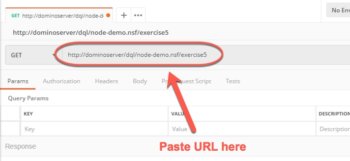
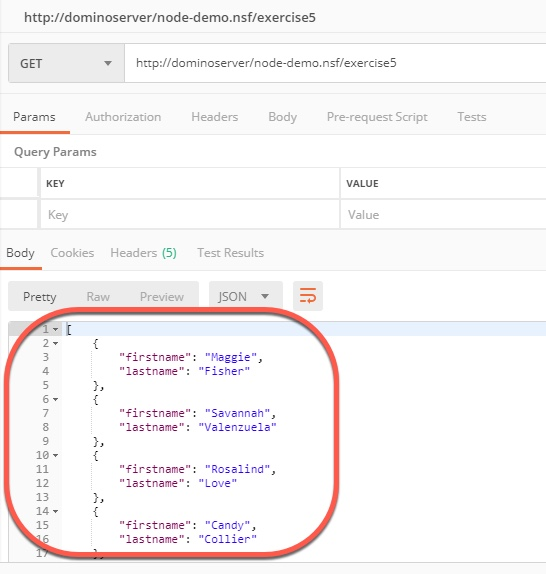

1. To invoke the agent, use the Postman application which is installed in the image.  Open Postman by double-clicking on its icon on the Desktop.

    

    Postman lets us invoke REST URLs, so we can use it to test our new agent.  Create a new Request if necessary, and paste in the following URL:

    ```
    http://dominoserver/dql/node-demo.nsf/exercise5
    ``` 

    Your page should look like this:

    

1. Hit Enter or click the blue **Send** button.  You should see the results returned as JSON.

    


Congratulations! You've written a Java agent which uses DQL.