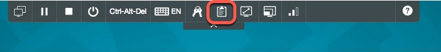
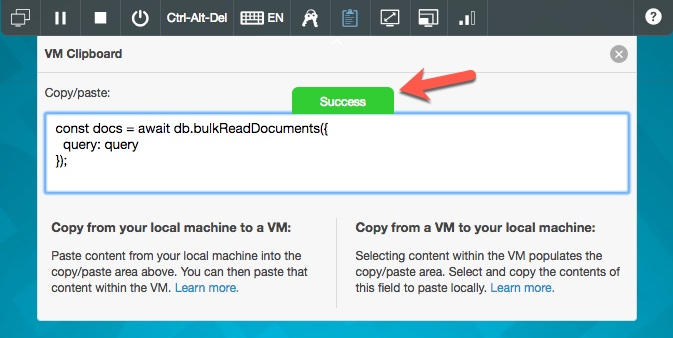

As we said earlier, the client image is available via a web browser. The Notes client is installed on the client image; the lab does not require you to use the client, but you may want look at the databases used in the lab in order to experiment with your own queries.  The password is `passw0rd`.  Reminder: the user is a Domino Administrator, so be careful! With great power....

-----

Depending on the size of your monitor and the resolution of your Desktop, you may want to resize the browser window.  If you do this, you can resize the client desktop by using the Fit to Window icon in the toolbar at the top of the client image, as shown in this screen shot:

-----

You may be viewing this lab in a browser on the actual (host) computer you are using, instead of in the client image itself. This is fine, and there is a way to copy code snippets from the host computer to the image in the browser tab.  Follow these instructions:

1. To copy a code snippet from the lab, click on the copy icon just above the snippet, as shown in this screen shot:

    

    The code snippet is now in your clipboard on your host computer.

1. Go to the browser tab where you have logged on to the client image, and click on the Clipboard icon.

    

1. The clipboard drawer will open, and you can paste your code snippet into it with CTRL-V.  The green "Success" indicator will glow, and then the drawer will close automatically; this is your indication that the code snippet is now in the clipboard of the client image.

    

    
NOTE: If the drawer does not close automatically, then repeat these steps.  In our experience with the image, it sometimes takes two or three runs through this process to get the content to transfer to the client image.