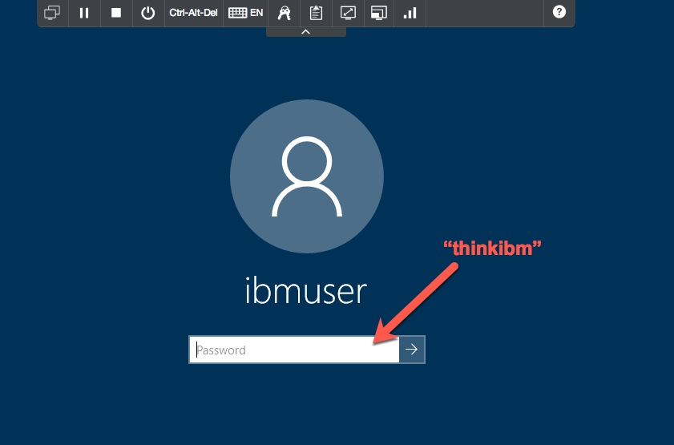

Our first task is to install the **domino-db** npm package.

1. Log in to the Windows 10 client by clicking anywhere on the Desktop, and then logging in with the user `ibmuser` and the password `thinkibm`.

    

  

1. Open a Command Prompt by clicking on the icon in the system tray, and change to the `Desktop\Think_6051\exercises` directory, as shown.

    

1. The **domino-db** package has already been downloaded to your image; it's in the Downloads directory.  To install it, type `npm install c:\users\ibmuser\Downloads\domino-domino-db-1.1.0.tgz` and hit Enter.

    

1. The installation will proceed, and when it is finished you can type the `dir` command to see that a `node_modules` directory has been created.  The **domino-db** package has been installed.  You are ready to proceed to the first exercise.  Leave the command prompt open, as you'll use it in the exercises which follow.

    
