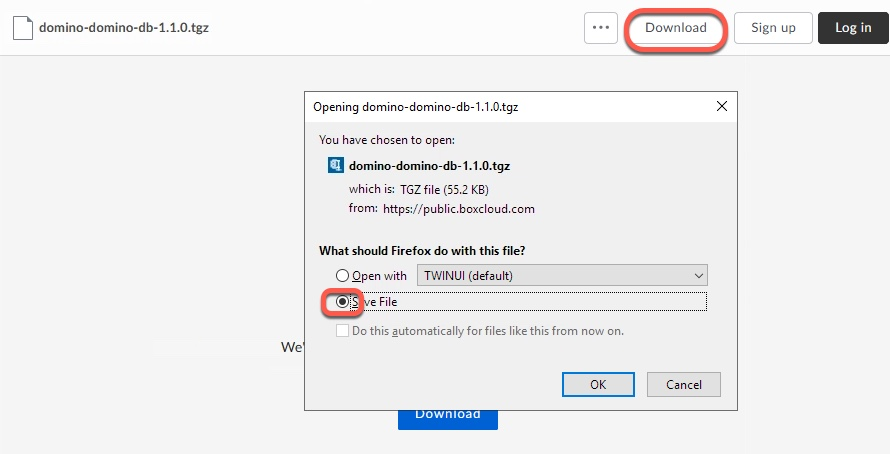
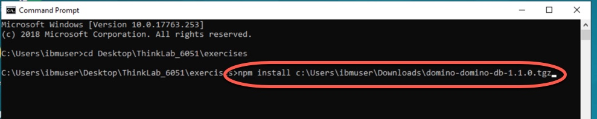
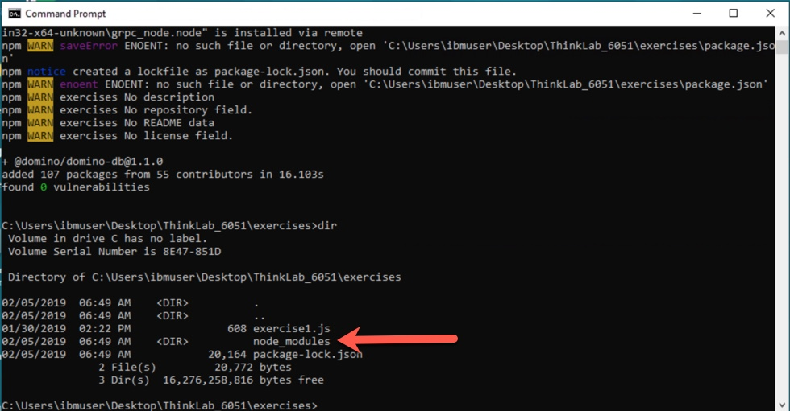

NOTE: These instructions step through how to download and install the domino-db package on the Windows 10 image provided in this lab. It may have already been done; your instructor will tell you whether you need to complete this step.  If not, then please proceed to Exercise 1.

1. Download the domino-db package by opening a browser and navigate to the following web site: **http://ibm.biz/domino-db**.  Save the file to your Downloads folder.

2. Open a Command Prompt by clicking on the icon in the system tray, and change to the `Desktop\Think_6051\exercises` directory, as shown.

3. Type `npm install c:\users\ibmuser\Downloads\domino-domino-db-1.1.0.tgz` and hit Enter.

4. The installation will proceed, and when it is finished you can type the `dir` command to see that an `node_modules` directory has been created.  The **domino-db** package has been installed.  You are ready to proceed to the first exercise.

